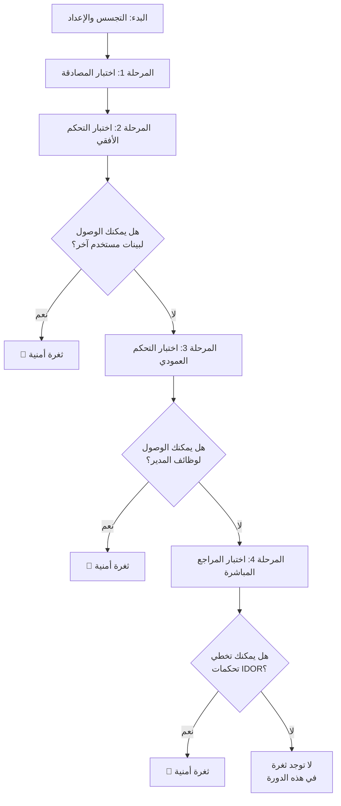

# منهجية عملية للكشف عن ثغرات ( Access Control, IDOR )
## 🔍 خريطة العملية الشاملة

## **المرحلة <mark style="background: #ADCCFFA6;">1: اختبار إدارة المصادقة والجلسات</mark>**
تركز هذه المرحلة على بوابة التطبيق الرئيسية.

*   **الخطوة 1: إنشاء حسابات اختبار**: أنشئ حسابين مستخدمين على الأقل بنفس مستوى الصلاحية (مثل `مستخدم أ` و `مستخدم ب`). إذا أمكن، أنشئ حساب مدير.
*   **الخطوة 2: تحليل رموز الجلسة**: سجل الدخول كـ `مستخدم أ` وافحص ملف تعريف الارتباط أو الرمز. ثم سجل الدخول كـ `مستخدم ب` وانظر إذا كان هيكل الرمز مختلفاً.
*   **الخطوة 3: اختبار الإعدادات الخاطئة**: سجل الدخول كـ `مستخدم أ`، ثم استبدل رمز جلستك برمز `مستخدم ب` (أو المدير) دون تسجيل الخروج. إذا منحك هذا الوصول لبيانات `مستخدم ب`، فهذه ثغرة حرجة.

## **المرحلة <mark style="background: #ADCCFFA6;">2: اختبار التحكم الأفقي في الوصول</mark>**
يتحقق هذا من إمكانية وصولك لبيانات مستخدم آخر أو موارده بنفس مستوى الصلاحية.

*   **الخطوة 1: تعيين الطلبات الخاصة بالمستخدم**: أثناء تسجيل الدخول كـ `مستخدم أ`، حدد جميع الطلبات التي تجلب بياناتك الشخصية. مثلاً: طلب `GET` إلى `/api/users/123/profile`.
*   **الخطوة 2: التلاعب في المعاملات**: حاول الوصول لبيانات `مستخدم ب` بتغيير المعرّف في الطلب. مثلاً: غير الرابط من `/api/users/123/profile` (ملفك الشخصي) إلى `/api/users/124/profile` (ملف `مستخدم ب`). إذا استطعت رؤية ملف `مستخدم ب`، فقد وجدت ثغرة IDOR.
*   **الخطوة 3: اختبار طرق HTTP الأخرى**: لا تختبر طلبات `GET` فقط. جرب تغيير أو حذف البيانات عبر طلبات `POST`, `PUT`, `PATCH`, و `DELETE` باستخدام معرّف مورد مستخدم آخر.

## **المرحلة <mark style="background: #ADCCFFA6;">3: اختبار التحكم العمودي في الوصول</mark>**
يتحقق هذا مما إذا كان المستخدم العادي يمكنه تنفيذ إجراءات محجوزة لمستخدمين أعلى صلاحية.

*   **الخطوة 1: اكتشاف نقاط النهاية المميزة**: كمستخدم مدير، لاحظ الوظائف والروابط المتاحة لك فقط (مثل `/admin/user-manager`, `/api/admin/reports`).
*   **الخطوة 2: الوصول كمستخدم عادي**: اخرج من حساب المدير وسجل الدخول كمستخدم عادي (`مستخدم أ`). حاول الوصول مباشرة لروابط المدير التي اكتشفتها.
*   **الخطوة 3: تزوير الطلبات المميزة**: حتى لو كان قائمة المدير مخفية، حاول إرسال طلب HTTP مباشر لإنشاء مستخدم جديد أو حذف منشور.

## **المرحلة<mark style="background: #ADCCFFA6;"> 4: اختبار المراجع المباشرة غير الآمنة (IDOR</mark>)**
هذه نظرة مركزة على ثغرات IDOR.

*   **الخطوة 1: ابحث عن المعرّفات المتوقعة**: تستخدم التطبيقات عادة معرّفات رقمية متسلسلة، UUIDs، أو أسماء مستخدمين.
*   **الخطوة 2: جرب أنواع معرّفات مختلفة**: إذا كان لديك معرّف رقمي، جرب زيادته أو إنقاصه. إذا كان اسم مستخدم، جرب استبداله باسم مستخدم آخر.
*   **الخطوة 3: تخطي فحوصات "المصدر"**: بعض التطبيقات تتحقق من header `Referer`. جرب إزالته أو تعيينه لصفحة "مسموحة".

##  و <mark style="background: #FFF3A3A6;">💡 نصائح مهمة للاختبار الفعال</mark>

*   **الفحص من جانب الخادم هو الأساس**: الخطأ الشائع هو إخفاء زر أو رابط بدلاً من تنفيذ تحقق من جانب الخادم. **اختبر دائماً بإرسال طلبات مباشرة لخادم API**.
*   **السياق مهم**: تأثير ثغرة IDOR يعتمد على البيانات التي يتم الوصول لها.
إليك شرح مفصل لطريقة استخدام Burp Suite في اختبار الاختراق، من الإعداد الأولي إلى التنفيذ العملي.
---
### 🛠️ الأدوات الرئيسية في Burp Suite واستخدامها

| الأداة         | الوظيفة الرئيسية                                                             | استخدام في اختبار الاختراق                                                                |
| :------------- | :--------------------------------------------------------------------------- | :---------------------------------------------------------------------------------------- |
| **Proxy**⚙️    | اعتراض الطلبات والاستجابات بين المتصفح والخادم.                              | نقطة البداية لمراقبة وتحليل وتعديل كل حركة المرور يدوياً.                                 |
| **Repeater**🔁 | إعادة إرسال الطلب نفسه مراراً مع إدخال تعديلات طفيفة عليه.                   | مثالية للتجربة يدوياً واستكشاف ثغرات مثل حقن SQL (SQL Injection) أو كسر كلمات المرور.     |
| **Intruder**⚔️ | أتمتة هجمات إرسال عدد كبير من الطلبات.                                       | إجراء هجمات القوة الغاشمة (Brute-force)، أو مسح المعلمات (Fuzzing) لاكتشاف ثغرات الإدخال. |
| **Scanner**🔍  | (في النسخة المدفوعة) المسح التلقائي للبحث عن ثغرات أمنية شائعة.              | اكتشاف ثغرات مثل XSS و SQL Injection تلقائياً وبسرعة.                                     |
| **Decoder**🔤  | ترميز (Encode) وفك ترميز (Decode) البيانات إلى صيغ مختلفة (مثل Base64, URL). | تحليل البيانات المشفرة التي يعترضها البروكسي أو تحضير حمولات (Payloads) مشفرة.            |
